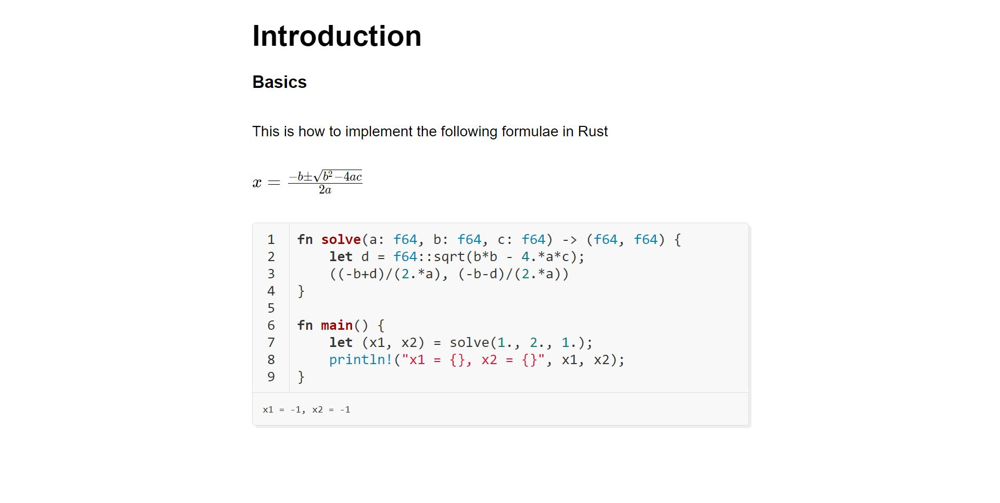
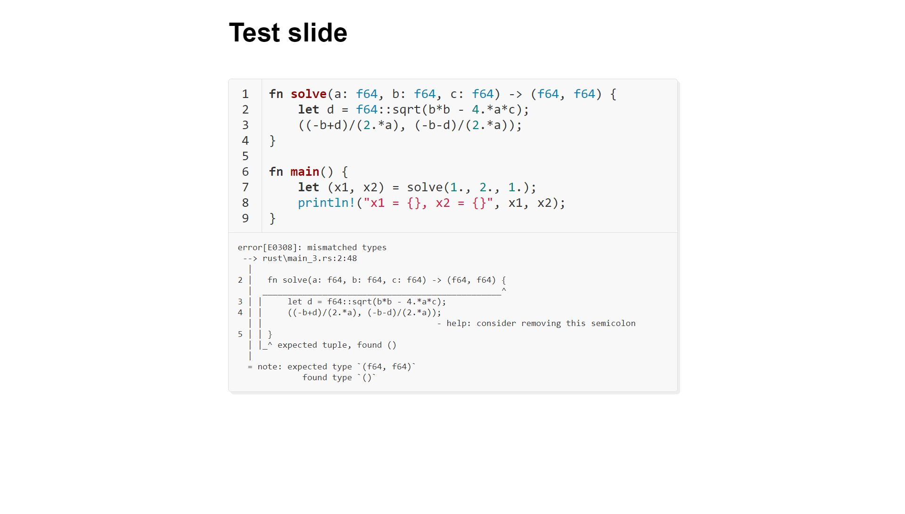

# mrend

A markdown presentation generator tool



# Default configuration

`mrend` comes with some plugins that are preset for FMI's Rust course.
Of course you can tweak them or remove them whatsoever to make it work for your own needs.

# Getting started

### Prerequisites

You will need [Node.js](https://nodejs.org/) and [Yarn](https://yarnpkg.com/).
Npm could work as well but who would use that anyway ;)

If you intend to use the Rust plugin you will also need [rustup](https://rustup.rs/) with
stable and nightly toolchains.

### Setup

Clone this repo using `git clone https://github.com/d3lio/mrend.git`.

Navigate into the folder where you cloned the tool and run `yarn install`.

### Build a presentation

To build a presentation do `yarn run build <path/to/file.md>`.

To build the example presentation do `yarn run build example.md`. It will generate `output.html`.

Open the output into your preferred browser and enjoy.

# Usage

You should also be familiar with markdown syntax before you begin for obvious reasons.

### Metadata

Every `mrend` presentation has a metadata header that looks like this

```
---
title: My Presentation
output: output.html
---
```

This way you can configure your presentation without having to pass any special arguments to `mrend`.
Each presentation has its own such properties and you won't have to remember to pass them
every time you need to rebuild the presentation.

The above example declares two properties - the `title` and the `output`. The former is your
presentation's title. The latter is the file in which `mrend` will generate the presentation.

To see the whole set of properties go to [example.md](example.md)

### Slides

Of course this wouldn't be a presentation generator if it couldn't create slides.
To do so mrend uses `---` as a slide separator. For example

```
# Slide 1

content

---
# Slide 2

more content!
```

### Animated slides

The slides can be split into animated parts. Lets say we have a list and we want to show the bullets
one by one. This can be achieved by using `--`:

```
# Slide

* Item1
--
* Item2
--
  - Subitem
```

The generated presentation will contain a slide for each split to create the fealing for an animated list.
When changing slides instead of going to the next whole slide you will render the next subslide segment.

### Rust code

With the default preset there is a plugin that verifies the rust code blocks. There is some special
syntax to remember which closely resembles Rust's doc tests.

* by default all Rust code blocks are compiled and executed and the output is shown below the block
* `# ` (# followed by 1 space) prepends code that will be used by the compiler but not shown to the user
* `# // norun` on the first line of the code block indicates that the code will be compiled but not runned
* `# // ignore` on the first line of the code block indicates that the code will not be compiled nor runned



# Plugins

Plugins reside in `src/backend/plugins`. The order in which they are executed is defined by
`src/backend/plugins.json`.

For now if you need to write plugins check out the preset ones in [src/backend/plugins](src/backend/plugins)
or open an issue for help. You can also check out
[showdownjs extensions](https://github.com/showdownjs/showdown/wiki/extensions)

A plugins API documentation is on the way!

# TODO

* List animations
* Code block animations
* Side by side code blocks
